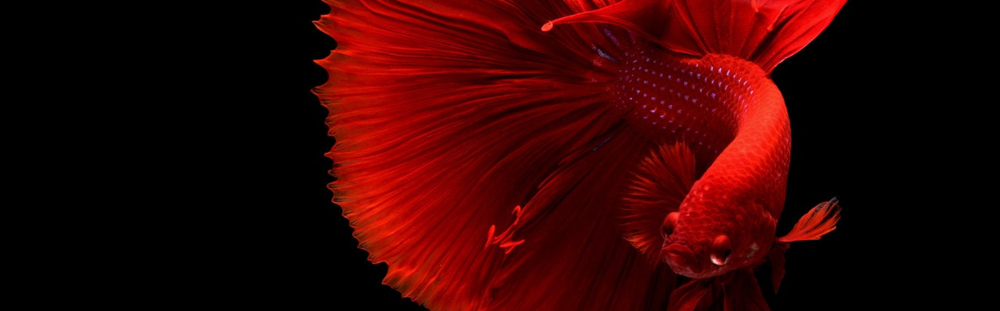

# Fish && Chips

An Open Source Fish Robot

**Note:** This is a Work in Progress

#### Authors
* [Cristina De Propios](https://twitter.com/de_propios) - [Website](http://www.depropios.com/)
* [David Estévez Fernández](https://twitter.com/DEFrobotics) - [Website](https://destevez.me)

## The Project

For this collaboration, we wanted a project that would allow us to design something functional and aesthetically pleasing. We also wanted the project to be a challenge. Due to our backgrounds it was more or less clear from the beginning that it had to be a robot but... what kind of robot?

We considered different animals as inspiration for our robot, but something about fish draw our attention. Their hypnotic movement, and the fact that they exist in a great variety of shapes and sizes, offered us a wide range of possibilities for our design. In addition, the natural medium for fish is water, which does not get along pretty well with electronics, making fish robots a rare morphology compared with other kind of robots such as hexapods, quadrupeds or humanoids, and creating the challenge we were looking for. 

A key idea while developing the project was that it should foster creativity, allowing people to create their own versions of the fish, even by traditional means, without requiring digital fabrication machines. For this purpose, our fish robot is composed of two main components. The first one is a standard core, that serves as a base for the fish, and offers an already tested solution for its movement and control, removing the need for advanced electronics or programming knowledge. The second one is a skin that surrounds the fish core and provides fins and a tail to propel the fish in water, as well as its external appearance. 

Being divided in two components makes is a perfect educational platform as it is possible to work on different aspects of the robot at different levels: from simply designing new skins to surround a standard core to a deeper understanding of the programming, electronics and mechanics of the robot by modifying the core.

This project is still a work in progress, but we deeply believe in the Open Source philosophy, so we are releasing our development files as we are developing and improving them. The prototype, along with other tests and experiments, will be displayed at the [Open Source Hardware Demonstration (OSHWDem) 2019](https://oshwdem.org/).

## Betta Fish: The Peleator

For the first fish of the Fish && Chips project, called *Peleator*, we chose as inspiration the Betta Fish. The Betta Fish (*Betta splendens*) is also known as the Siamese Fighting Fish, hence the name Peleator¹. 

We like this species because of three things: it's a though fighter, it's beautiful, and it's easy to maintain, requiring little more than food. Just like us.

¹ For all non-spanish speakers out there, Peleator is a made-up-latin name derived from *pelear*, which means *to fight* in spanish. It also sounds like a name one would use for a large translatlantic boat, which (for us) makes it even funnier.

## Evolution

This will show the evolution of the prototype. The aim of the first version is not to be submergible, but to grasp a good notion of what the robot needs. Swimming is a larger challenge that will come later on.

### Early prototypes

### Working core

### Tail and Skin

## Building a Peleator

**NOTE**: THIS IS A WORK IN PROGRESS. IT PROBABLY WON'T WORK RIGHT AWAY, SO PLEASE KEEP THIS IN MIND BEFORE BUILDING ONE. WE ARE CURRENTLY FOCUSED ON DEVELOPMENT, SO NO FURTHER SUPPORT WILL BE PROVIDED FOR BUILDING AN EARLY PROTOTYPE. YOU ARE ON YOUR OWN (GOOD LUCK!)

### Mechanics

### Circuits

### Programming
